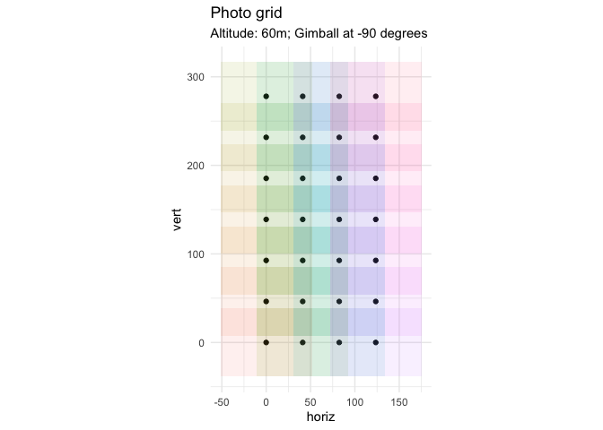

<!-- README.md is generated from README.Rmd. Please edit that file -->

# flightplanner

<!-- badges: start -->

[](https://www.repostatus.org/#wip)

<!-- badges: end -->

`flightplanner` is a tool for creating flight plans for use with the
Litchi software. It allows users to specify the latitude and longitude
of an origin point, as well as the dimensions, orientation, and altitude
of a survey area. The tool then calculates the best positions for
capturing photos of the survey area using a drone-mounted camera with a
vertical orientation. The resulting flight plan is designed to create an
orthomosaic from a series of overlapping images taken in a grid pattern.
`flightplanner` also provides visualization features for previewing the
flight plan and survey photo grid.

## Installation

You can install the development version of `flightplanner` like this:

``` r
# install package 'remotes' if necessary
# will already be installed if 'devtools' is installed
install.packages("remotes")
```

## Usage

First remember to load the package.

``` r
library(flightplanner)
```

To plan a mission, follow these steps:

1.  Determine the horizontal and vertical extent of your survey area,
    measured in meters from the origin point. For example, you might
    choose a horizontal limit of 100 meters to the east and a vertical
    extent of 200 meters to the north.
2.  Set the altitude of your survey area, measured in meters above the
    origin point. For example, you might choose an altitude of 60
    meters.
3.  Run the `fp_photo_grid` function with the `horiz`, `vert`, and
    `altitude` arguments from steps 1 and 2. Set the `plot` argument set
    to `TRUE` to visualize your photo survey grid in a plot. Modify the
    function’s settings (e.g. including desired overlap in vertical and
    horizontal directions) until you are satisfied with the layout of
    the grid.
4.  Decide on an origin point for your survey area, defined by its
    latitude and longitude coordinates (e.g. 55.125505, 10.268467). This
    will be the lower left point of your image grid.
5.  Decide on an angle by which the survey grid needs to be
    pivoted/rotated around this origin point (e.g. 45 degrees).
6.  Use the `fp_litchi_mission` function to generate a flight mission
    plan for use with the Litchi Mission Hub app. This mission plan is a
    `data.frame` which you save as a CSV file for use in the Litchi
    Mission Hub app.
7.  Check your plan on the Litchi MissionHub and adjust as necessary.

Be aware that the plan assumes that the topology is flat, that there are
no trees or other structures. Therefore, pay particular attention to the
altitude in areas that violate these assumptions.

Here’s a worked example.

First make a photo grid:

``` r
fp_photo_grid(altitude = 60, overlap_width = 0.6,
overlap_height = 0.4, survey_xaxis = 140, survey_yaxis = 300, plot = TRUE)
```

<!-- -->

Then, when satisfied with this, run it again with `plot = FALSE` to get
the photo grid.

``` r
pg <- fp_photo_grid(altitude = 60, overlap_width = 0.6,
overlap_height = 0.4, survey_xaxis = 140, survey_yaxis = 300, plot = FALSE)
```

Next, produce the litchi plan:

``` r
mission1 <- fp_litchi_mission(pg, origin_lat = 55.125505, origin_long = 10.268467, angle = 38)
head(mission1)
#>        lat      lng altitude heading curve rotationdir gimbalmode gimbalangle
#> 1 55.12511 10.26934       60      38     0           0          2         -90
#> 2 55.12524 10.26905       60      38     0           0          2         -90
#> 3 55.12530 10.26960       60      38     0           0          2         -90
#> 4 55.12537 10.26876       60      38     0           0          2         -90
#> 5 55.12543 10.26931       60      38     0           0          2         -90
#> 6 55.12549 10.26985       60      38     0           0          2         -90
#>   actiontype1 actionparam1 actiontype2 actionparam2 altitudemode rowNumber
#> 1           0         1500           1            0            0         1
#> 2           0         1500           1            0            0         2
#> 3           0         1500           1            0            0         3
#> 4           0         1500           1            0            0         4
#> 5           0         1500           1            0            0         5
#> 6           0         1500           1            0            0         6
```

This file can then be exported like this, ready to be uploaded to the
Litchi Mission Hub.

    write.csv(x = mission1, file = "missionFiles/mission1.csv",
    row.names = FALSE)

## Note

WARNING: This package was developed for my own use and may contain bugs
or errors. Please use caution when using it, and carefully check your
plan using Litchi or Google Earth. The plans generated by this package
are ignorant of landscape topology, trees, buildings and other
structures, so please plan accordingly. The use of this package and the
resulting plans are your responsibility. I hope that it can be useful,
but use it at your own risk.

## Contributions

All contributions are welcome. Please note that this project is released
with a [Contributor Code of
Conduct](https://contributor-covenant.org/version/2/0/CODE_OF_CONDUCT.html).
By participating in this project you agree to abide by its terms.

There are numerous ways of contributing.

1.  You can submit bug reports, suggestions etc. by [opening an
    issue](https://github.com/jonesor/flightplanner/issues).

2.  You can copy or fork the repository, make your own code edits and
    then send us a pull request. [Here’s how to do
    that](https://jarv.is/notes/how-to-pull-request-fork-github/).

3.  You are also welcome to email me.
